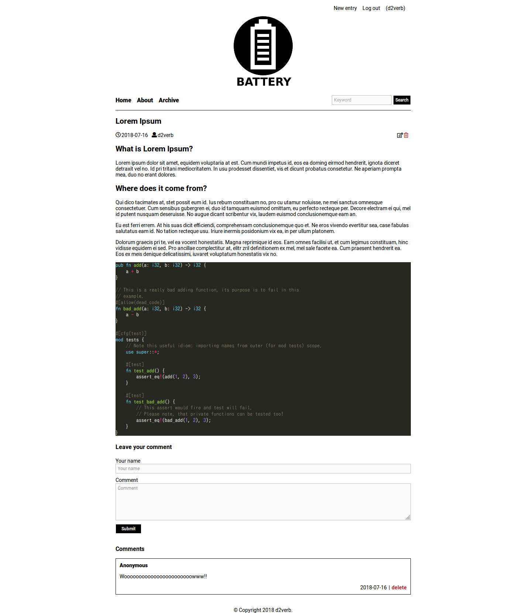

Battery is a blog engine written in python. Note that this project is WIP.

## Features
- [x] post entry
- [x] delete entry
- [x] post comment
- [x] delete comment
- [ ] user registration
- [ ] preview
- [ ] TeX extension
- [ ] security features

## ScreenShots

## Copyrights
This software is released under the MIT License, see LICENSE.
